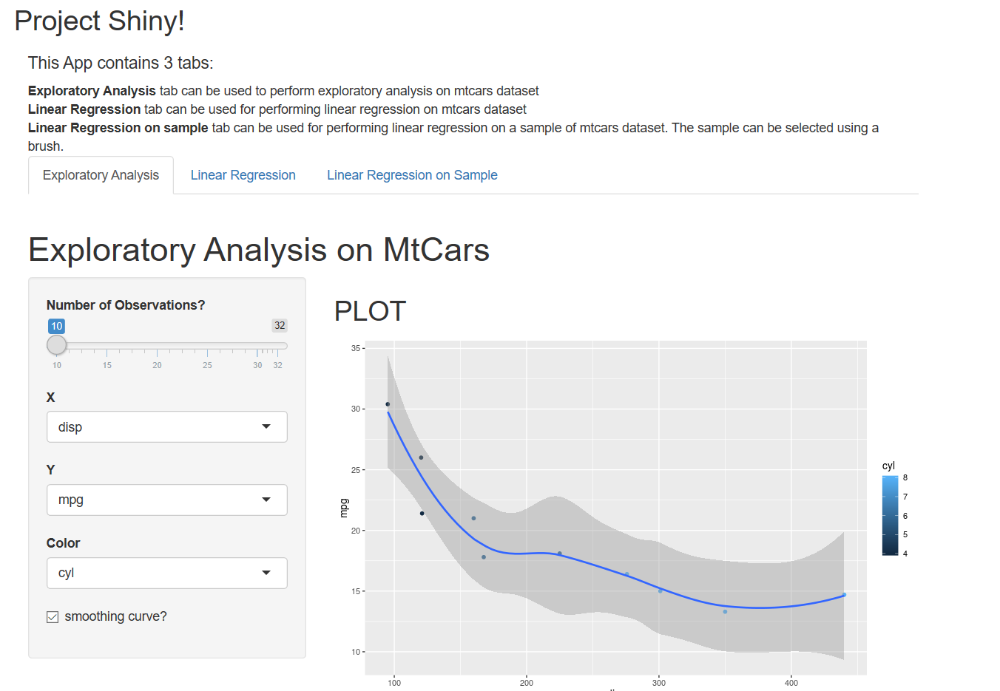

  Shinyapp Instructions
========================================================
author: Himank Jain
date:   01/09/2019
autosize: true

Introduction
=======================================================

The Shiny App can be found here knitr::include_graphics("https://himankjn.shinyapps.io/ShinyApp/")

The app provides a Graphical User Interface to perform exploratory Data analysis and linear regression on mtcars Dataset. The app contains three tabls all together.

The First Tab is specifically meant for exploratory data analysis using visualization. The visualization code was mostly written though R ggplot2 library.

The Second Tab is meant for performing linear regression on mtcars dataset with mpg as dependent variable disp as independent variable.

The Third Tab can be used to perform the same linear regression but only on the selected observations. The observations can be selected using brush(drag and select).

Dataset Fields
========================================================
The following variables are available in mtcars dataset:
* mpg Miles/(US) gallon
* cyl Number of cylinders
* disp Displacement (cu.in.)
* hp Gross horsepower
* drat Rear axle ratio
* wt Weight (lb/1000)
* qsec 1/4 mile time
* vs V/S
* am Transmission Type 
* gear Number of forward gears
* carb Number of carburetors

ui.r code
========================================================


```r
library(shiny)
library(ggplot2)
dataset<-mtcars
shinyUI(fluidPage(
    
    titlePanel("Project Shiny!"),
    mainPanel(
        h4("This App contains 3 tabs:"),
        HTML("<b> Exploratory Analysis</b> tab can be used to perform exploratory analysis on mtcars dataset <br><b> 
           Linear Regression</b> tab can be used for performing linear regression on mtcars dataset <br> <b> Linear Regression on sample</b> tab can be used for performing linear
           regression on a sample of mtcars dataset. The sample can be selected using a brush."),
    
    
    tabsetPanel(
        type="tabs",
        tabPanel("Exploratory Analysis
                 ",
                 br(),

                 h1("Exploratory Analysis on MtCars"),
                 sidebarLayout(
                     sidebarPanel(
                         sliderInput("n","Number of Observations?",10,nrow(dataset),value=10,step=5),
                         selectInput("xvar","X",names(dataset)),
                         selectInput("yvar","Y",names(dataset)),
                         selectInput("colorvar","Color",names(dataset)),
                         checkboxInput("smooth","smoothing curve?",value=FALSE)
                     ),
                     mainPanel(
                         h2("PLOT"),
                         plotOutput("xyplot")
                     )
                 )
                 
                 
        ),
        tabPanel("Linear Regression",
                 br(),
                 
                 h1("Linear Regression on MTcars"),
                 sidebarLayout(
                     sidebarPanel(
                         textInput("box1","Tab2 Heading?",value="Linear Regression"),
                         sliderInput("slider1","Select mpg to predict disp!",5,35,value=20),
                         h3("Intercept:"),
                         textOutput("intout"),
                         h3("Slope:"),
                         textOutput("slopeout")
                         
                         
                     ),
                     mainPanel(
                         code("plot(mtcars$mpg,mtcars$disp,pch=16,col='blue',cex=2)"),
                         plotOutput("plot1"),
                         h2("predicted value:"),
                         h3( textOutput("pred"))
                         
                         
                     )
                 
        )
   
        ),
        tabPanel("Linear Regression on Sample",
                 br(),
                 
                 h1("Multiple Models"),
                 sidebarLayout(
                     sidebarPanel(
                         h2("Drag and Select a number of points to fit a linear model to them !"),
                         h3("Slope"),
                         textOutput("slopeOut"),
                         h3("intercept"),
                         textOutput("intOut")
                     ),
                     mainPanel(
                         h2("Data"),
                         plotOutput("plot2",brush=brushOpts(
                             id="brush1"
                         ))
                     )
                 )
                 
                 )
        ))
))
```

<!--html_preserve--><div class="container-fluid">
<h2>Project Shiny!</h2>
<div class="col-sm-8">
<h4>This App contains 3 tabs:</h4>
<b> Exploratory Analysis</b> tab can be used to perform exploratory analysis on mtcars dataset <br><b> 
           Linear Regression</b> tab can be used for performing linear regression on mtcars dataset <br> <b> Linear Regression on sample</b> tab can be used for performing linear
           regression on a sample of mtcars dataset. The sample can be selected using a brush.
<div class="tabbable">
<ul class="nav nav-tabs" data-tabsetid="7703">
<li class="active">
<a href="#tab-7703-1" data-toggle="tab" data-value="Exploratory Analysis&#10;                 ">Exploratory Analysis
                 </a>
</li>
<li>
<a href="#tab-7703-2" data-toggle="tab" data-value="Linear Regression">Linear Regression</a>
</li>
<li>
<a href="#tab-7703-3" data-toggle="tab" data-value="Linear Regression on Sample">Linear Regression on Sample</a>
</li>
</ul>
<div class="tab-content" data-tabsetid="7703">
<div class="tab-pane active" data-value="Exploratory Analysis&#10;                 " id="tab-7703-1">
<br/>
<h1>Exploratory Analysis on MtCars</h1>
<div class="row">
<div class="col-sm-4">
<form class="well">
<div class="form-group shiny-input-container">
<label class="control-label" for="n">Number of Observations?</label>
<input class="js-range-slider" id="n" data-min="10" data-max="32" data-from="10" data-step="5" data-grid="true" data-grid-num="4.4" data-grid-snap="false" data-prettify-separator="," data-prettify-enabled="true" data-keyboard="true" data-data-type="number"/>
</div>
<div class="form-group shiny-input-container">
<label class="control-label" for="xvar">X</label>
<div>
<select id="xvar"><option value="mpg" selected>mpg</option>
<option value="cyl">cyl</option>
<option value="disp">disp</option>
<option value="hp">hp</option>
<option value="drat">drat</option>
<option value="wt">wt</option>
<option value="qsec">qsec</option>
<option value="vs">vs</option>
<option value="am">am</option>
<option value="gear">gear</option>
<option value="carb">carb</option></select>
<script type="application/json" data-for="xvar" data-nonempty="">{}</script>
</div>
</div>
<div class="form-group shiny-input-container">
<label class="control-label" for="yvar">Y</label>
<div>
<select id="yvar"><option value="mpg" selected>mpg</option>
<option value="cyl">cyl</option>
<option value="disp">disp</option>
<option value="hp">hp</option>
<option value="drat">drat</option>
<option value="wt">wt</option>
<option value="qsec">qsec</option>
<option value="vs">vs</option>
<option value="am">am</option>
<option value="gear">gear</option>
<option value="carb">carb</option></select>
<script type="application/json" data-for="yvar" data-nonempty="">{}</script>
</div>
</div>
<div class="form-group shiny-input-container">
<label class="control-label" for="colorvar">Color</label>
<div>
<select id="colorvar"><option value="mpg" selected>mpg</option>
<option value="cyl">cyl</option>
<option value="disp">disp</option>
<option value="hp">hp</option>
<option value="drat">drat</option>
<option value="wt">wt</option>
<option value="qsec">qsec</option>
<option value="vs">vs</option>
<option value="am">am</option>
<option value="gear">gear</option>
<option value="carb">carb</option></select>
<script type="application/json" data-for="colorvar" data-nonempty="">{}</script>
</div>
</div>
<div class="form-group shiny-input-container">
<div class="checkbox">
<label>
<input id="smooth" type="checkbox"/>
<span>smoothing curve?</span>
</label>
</div>
</div>
</form>
</div>
<div class="col-sm-8">
<h2>PLOT</h2>
<div id="xyplot" class="shiny-plot-output" style="width: 100% ; height: 400px"></div>
</div>
</div>
</div>
<div class="tab-pane" data-value="Linear Regression" id="tab-7703-2">
<br/>
<h1>Linear Regression on MTcars</h1>
<div class="row">
<div class="col-sm-4">
<form class="well">
<div class="form-group shiny-input-container">
<label for="box1">Tab2 Heading?</label>
<input id="box1" type="text" class="form-control" value="Linear Regression"/>
</div>
<div class="form-group shiny-input-container">
<label class="control-label" for="slider1">Select mpg to predict disp!</label>
<input class="js-range-slider" id="slider1" data-min="5" data-max="35" data-from="20" data-step="1" data-grid="true" data-grid-num="10" data-grid-snap="false" data-prettify-separator="," data-prettify-enabled="true" data-keyboard="true" data-data-type="number"/>
</div>
<h3>Intercept:</h3>
<div id="intout" class="shiny-text-output"></div>
<h3>Slope:</h3>
<div id="slopeout" class="shiny-text-output"></div>
</form>
</div>
<div class="col-sm-8">
<code>plot(mtcars$mpg,mtcars$disp,pch=16,col='blue',cex=2)</code>
<div id="plot1" class="shiny-plot-output" style="width: 100% ; height: 400px"></div>
<h2>predicted value:</h2>
<h3>
<div id="pred" class="shiny-text-output"></div>
</h3>
</div>
</div>
</div>
<div class="tab-pane" data-value="Linear Regression on Sample" id="tab-7703-3">
<br/>
<h1>Multiple Models</h1>
<div class="row">
<div class="col-sm-4">
<form class="well">
<h2>Drag and Select a number of points to fit a linear model to them !</h2>
<h3>Slope</h3>
<div id="slopeOut" class="shiny-text-output"></div>
<h3>intercept</h3>
<div id="intOut" class="shiny-text-output"></div>
</form>
</div>
<div class="col-sm-8">
<h2>Data</h2>
<div id="plot2" class="shiny-plot-output" style="width: 100% ; height: 400px" data-brush-id="brush1" data-brush-fill="#9cf" data-brush-stroke="#036" data-brush-opacity="0.25" data-brush-delay="300" data-brush-delay-type="debounce" data-brush-clip="TRUE" data-brush-direction="xy" data-brush-reset-on-new="FALSE"></div>
</div>
</div>
</div>
</div>
</div>
</div>
</div><!--/html_preserve-->

server.r code
========================================================


```r
library(shiny)

shinyServer(function(input, output) {
    
    dataset<-reactive({
        mtcars[sample(nrow(mtcars),input$n),]
    })
    output$xyplot<-renderPlot({
        g<-ggplot(data=dataset(),aes_string(x=input$xvar,y=input$yvar,col=input$colorvar))+geom_point()+labs(x=input$xvar,y=input$yvar)
        if(input$smooth){
        g<-g+geom_smooth()
        }
        g
    })
    
    
    model<-reactive({
        lm(data=mtcars,disp~mpg)
    })
    output$intout<-renderText({
        model()[[1]][1]
    })
    output$slopeout<-renderText({
        model()[[1]][1]
    })
    
    prediction<- reactive({
        predict(model(),newdata=data.frame(mpg=input$slider1))
    })
    output$plot1<-renderPlot({
        plot(mtcars$mpg,mtcars$disp,pch=16,col='blue',cex=2)
        abline(model(),col='red',lwd=2)
        points(input$slider1,prediction(),pch=16,cex=3)
    })
    output$pred<-renderText({prediction()})
    
    
    
    
    model2<-reactive({
        brushed_data<-brushedPoints(mtcars,input$brush1,
                                    xvar='mpg',yvar='disp')
        if(nrow(brushed_data)<2){
            return(NULL)
        }
        lm(disp~mpg,data=brushed_data)
    })
    output$slopeOut<-renderText({
        if(is.null(model2())){
            "No model found"
        }
        else{
            model2()[[1]][2]
        }
    })
    output$intOut<-renderText({
        if(is.null(model2())){
            "No model found"
        }
        else{
            model2()[[1]][1]
        }
    })
    output$plot2<-renderPlot({
        plot(mtcars$mpg,mtcars$disp,pch=16,cex=2,xlab="MPG",ylab="DISP")
        if(!is.null(model2())){
            abline(model2(),col='blue',lwd=2)
        }
    })
})
```

Sample Image from the Application:
========================================================


This image is a sample image from the actual application.

The link for the application can be found on next page.


Link To Mtcars ShinyApp
========================================================
[SHINY APP](https://himankjn.shinyapps.io/ShinyApp/)


THANK YOU!
